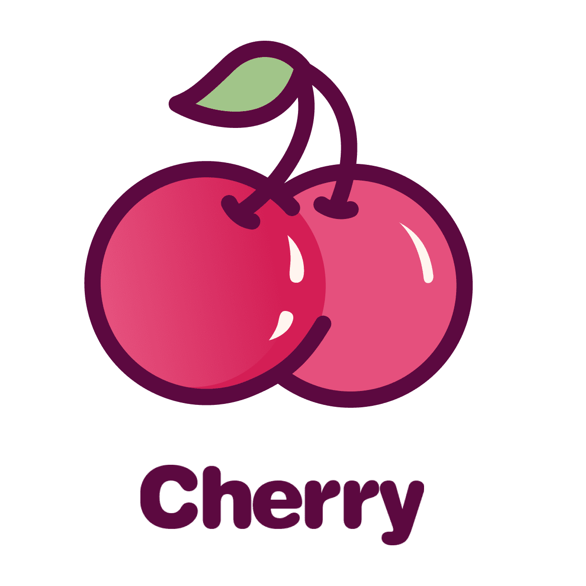
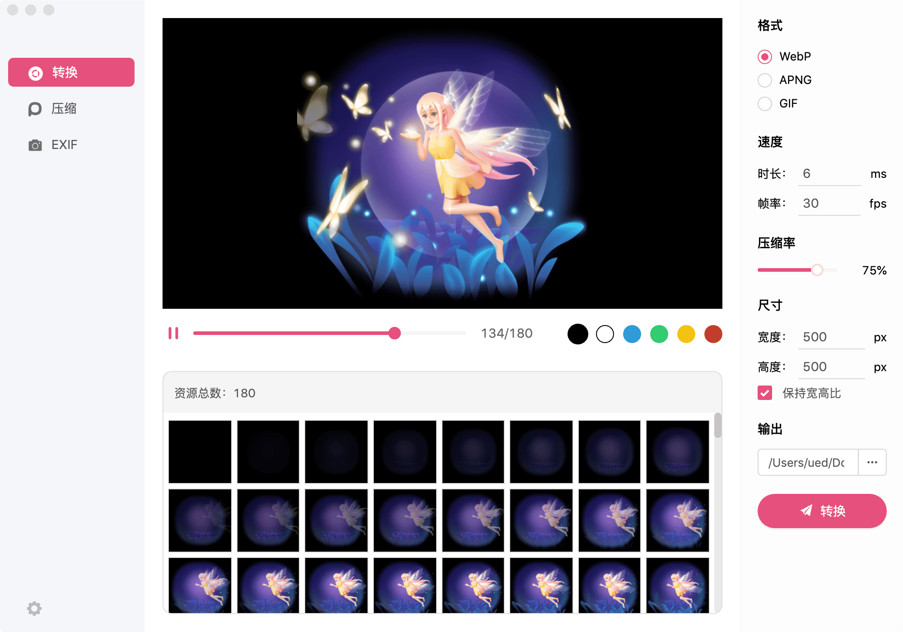
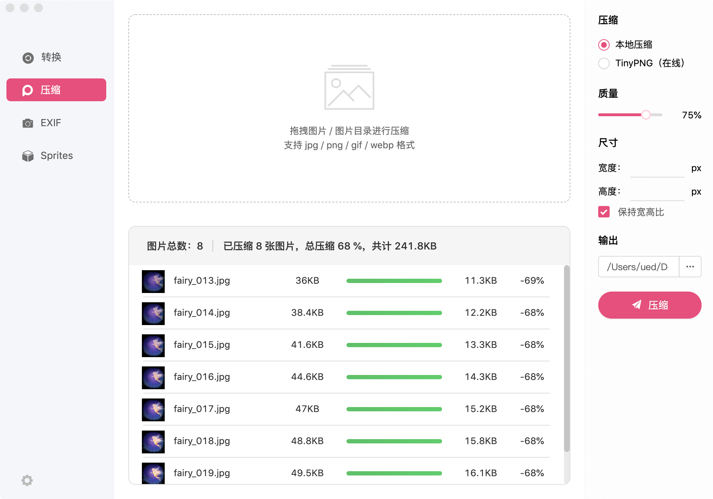
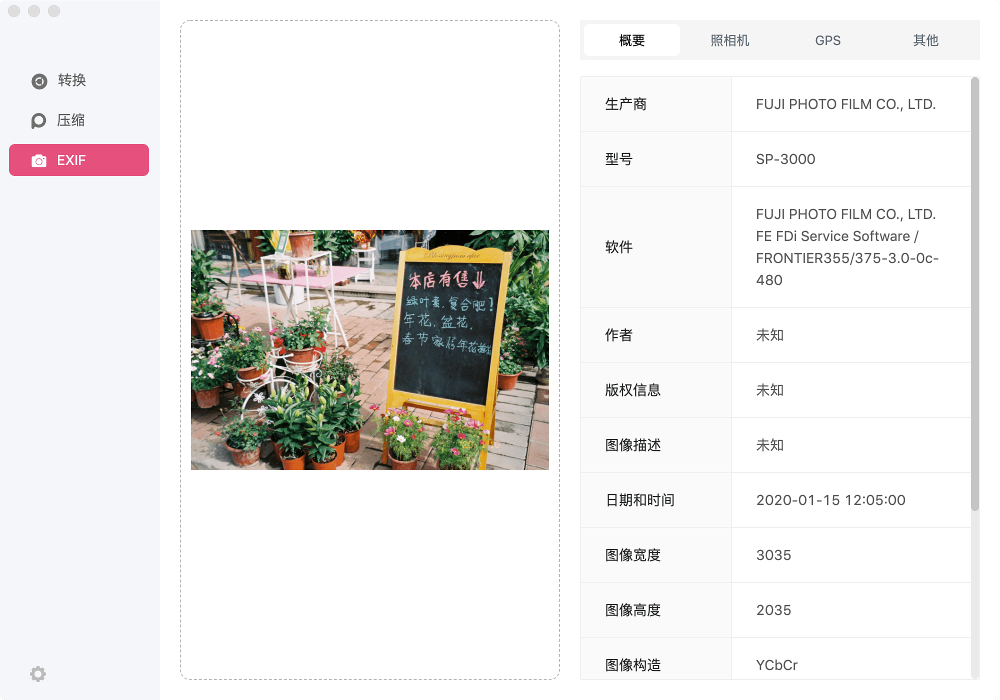
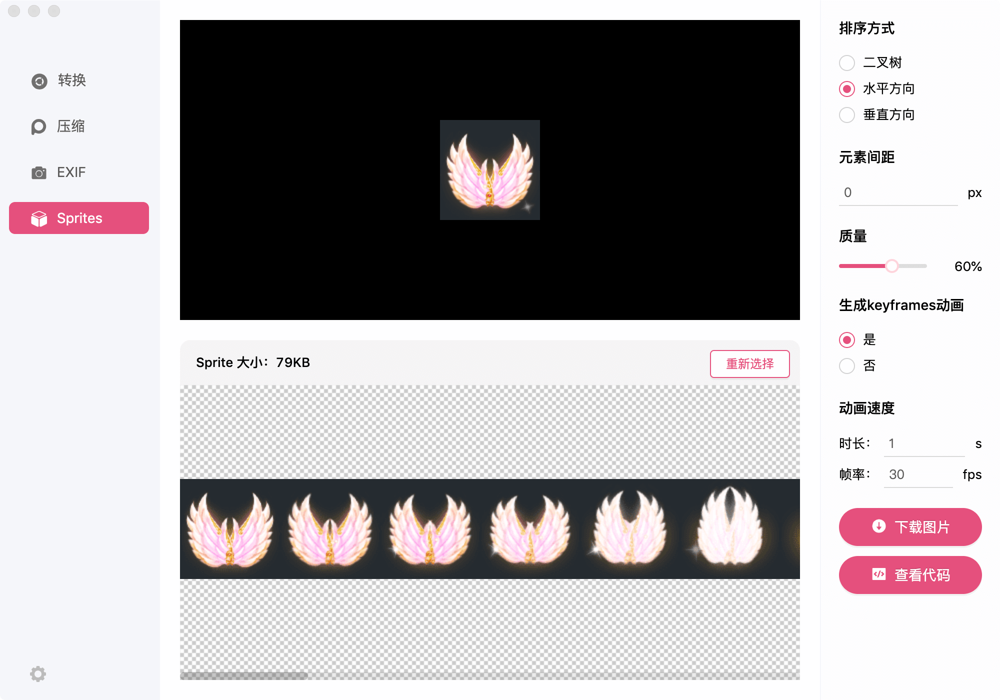

 

一款高效、好用的图片处理工具

   

  

   

## FOR WHAT？
* 拯救设计师找寻不同工具的苦恼
* 优化设计师输出

## 功能特性

✅  一键将SVGA/序列帧合成WebP/APNG/GIF  
✅  动画实时预览   
✅  更好用的SVGA播放器   
✅  SVGA素材下载与imageKey拷贝  
✅  高效多模式的图片压缩   
✅  照片EXIF信息查看  
✅  雪碧图合成 & keyframe代码合成

## 快速使用

### 下载相应版本  

* [Mac](https://yyued.github.io/cherry/) 
* [Windows](https://yyued.github.io/cherry/) 

### 使用转换功能  
*  输入为SVGA/序列帧
*  输出为WebP/APNG/GIF
*  输出尺寸修改
*  效果预览 & 单帧资源下载
*  序列帧修改时长&帧率
*  压缩率修改
*  自定义输出路径

   

 

### 使用压缩功能   
* 可压缩JPG/PNG/GIF/WEBP文件
* 可使用TinyPNG在线压缩
* 输出尺寸修改
* 压缩率修改

  

 

### 使用EXIF功能
* 输入为JPG/PNG
* 查看照片所有信息

   

 

### 使用雪碧图功能
* 输入为JPG/PNG
* 生成sprite图
* 自动生成keyframe动画
* keyframe代码导出

   

 

## 更新日志
您可以从 [更新日志](https://github.com/yyued/Cherry/releases) 获取相关版本信息。

 

## 获取帮助
如果您在使用的过程中碰到问题，可以通过下面几个途径寻求帮助：

利用强大的 issue 功能，您可以直接进行提问，我们会尽快排查相关问题并且进行修复。

